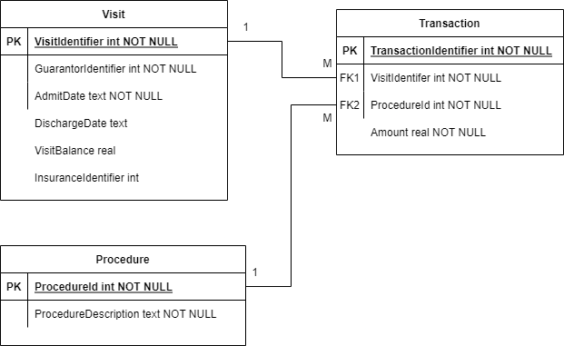

# VisitPay Data Engineering Assessment

Author: Lukas Gust

## Usage

Simply run the script using Python 3. All the libraries should be in the standard library. 

```
python app.py
```

## Assumptions 

Given the open nature of the problem statement and requirements there are a lot of things that need to be assumed depending on how its implemented. For example how are the new files going to show up? Is it on a data lake or local VM file system, etc. How large are the files? These kinds of questions need to be answered in order to architect and design any ETL application. For the sake of simplicity and timeliness we will generally assume the more basic cases when it comes to implementation and only discuss more complex problems that require different solutions.

Some things we will be assuming for this design. 

1. The raw data `HospitalABC_VisitPay_{type}_[YYYYmmdd_hhmmss].txt` will land on the applications machine (local machine , VM, etc.). 
   1. This allows us to simply use built in directory commands from the python libraries.
   2. We would have to use some form of client if the data were hosted external to the application.
2. We assume the application will be run on it's daily basis using a cron job or equivalent. That is the application will not be running when it is meant to be idle. 
   1. This is mimic a serverless architecture where we only run the compute when we need it.
   2. This does not line up with assumption #1 since the local storage on a serverless application is typically ephemeral, but in reality can be dealt with by hosting data external.
3. We assume that we do not need to process any hard deletes. We only need to handle upserts.
4. An sqlite database will take the place of hosting an external database.
5. We assume the datetimes in the filenames are in UTC.


## Design

Before vigorously typing on the keyboard... oh wait I've already done that above... before implementing any code we write up and describe the general design and maybe some specifics if necessary. This is necessary to keep our implementation in check while we deal with all the nuances that come with writing an application.

Here is a rough program flowchart in text form.

1. List all files in landing directory.
2. Filter files using a checkpoint.
   1. If a checkpoint exists then capture all files after that checkpoint in ascending order by the datetime on file name.
   2. Else capture all the files and process in ascending order by the datetime on file name.
3. Parse file names further to separate types.
4. Parse the .txt files into a data structures.
5. Upsert the records for each type in this order - Procedure, Visit, Transaction - into an sqlite database.

Some things to be concerned about. The .txt files have little to no standard of how they are structured. We have no guarantee that the files will arrive in the same structure currently present or if the values are sanitized before hand or if the datetimes in the file names are complete. Some of this we will handle and somethings we just cannot handle. In those cases where we cannot handle it we would have to log and alert the issues. 

Question is do we continue the process if we were unable to parse any of the file types? This is tough question to answer. If we're unable to process a Procedure file then we may be missing references in the latter file types, but in that same view point we could miss Visits that had valid references to a Procedure. In our approach we will continue and let the DBMS throw back the records with missing references and keep the ones that aren't. That way we have the most complete set of data in the database. Ultimately we would either need some sort of standard around the files that are landing or a robust parsing method that rarely fails.

Testing these pieces can help ensure that we can handle good and bad file names and even bad data values. We could set up unit tests for the apps functions and even set up some integration tests to see it all work together, or not. Eventually moving onto UAT where the data is validated by the users.

Below we've designed the ER diagram for the supporting DBMS.



## Conclusion

Overall with minimal testing the app runs well and accomplishes the task. Some areas where it could use more work are.

1. More robust regex for extracting datetimes from file names.
2. Testing framework around some of the smaller units as well as an integration test to repeatably test the greater functionality.
3. Depending on the volume of the data it may need more attention on how it is inserting and reading the data from the files.
4. More testing/QA around bad file structure or names.
5. Find repeatable code to reuse elsewhere given the right scenario. e.g. reading the files.
6. Refine the parametrization of the query.

Adding logging to the application while not a requirement allowed us to easily track down what the app was doing and was not much extra work. This could latter help us monitor the application and any potential inefficiencies.